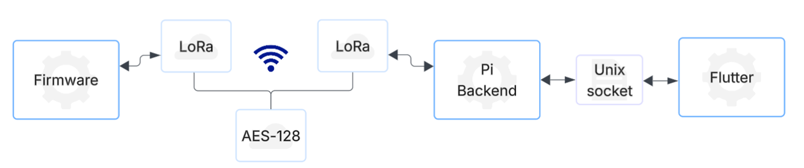

# Hydro LoRa Shield - Backup Communication System

This repository contains the backend software that runs on a Raspberry Pi 4. It serves as a bridge between the [Flutter frontend application](https://github.com/Hydro-backup-Systeem/Hydro_GUI.git) and the [LoRa-based firmware](https://github.com/Hydro-backup-Systeem/Hydro_Firmware.git). The script manages the LoRa module on the SX1276 shield to enable communication with the firmware. It also provides a Unix Domain Socket interface for interacting with the Flutter frontend, and handles encryption and packet fragmentation.



## Quick guide

To make this script work, you must first install the necessary tools to enable GPIO pin control on the Raspberry Pi:

```bash
# Install wiring-pi
sudo apt update
sudo apt install git
git clone https://github.com/WiringPi/WiringPi.git
cd WiringPi
./build

# Install SPIDEV
sudo apt update
sudo apt install python3-pip python3-dev

pip3 install spidev
```

> ⚠️ **Important:** Don't forget to enable SPI communication on the Raspberry Pi, as it's required to communicate with the LoRa chip.  
> You can enable SPI manually via the `raspi-config` settings under **Interface Options > SPI**.

After completing these steps, your setup should be ready to go and make an executable.

```bash
# Use the make file
make 
```

---

## Script overview

Below are the three main components that define what this script is designed to do:

- **Interface Connection**:
Manages a Unix Domain Socket that enables the Flutter frontend to send commands and messages from the GUI to the firmware.

- **LoRa Communication**
Utilizes the same LoRa library as the firmware to handle SPI-based communication with the SX1276 module, but edited. This component configures key radio parameters such as frequency, spreading factor, and bandwidth. It also manages both transmission and reception of data.

- **Packet Handler**
Handles the complete packet flow between the script and the firmware (e.g., the racecar). All communication is encrypted using AES-128 for security, and includes packet validation and error checking to ensure data integrity.

---

## Used Links
- [AES-128 Library](https://github.com/kokke/tiny-AES-c)
- [LoRa Module Handling](https://github.com/belyalov/stm32-hal-libraries/tree/master)
- [WiringPi](https://github.com/WiringPi/WiringPi)